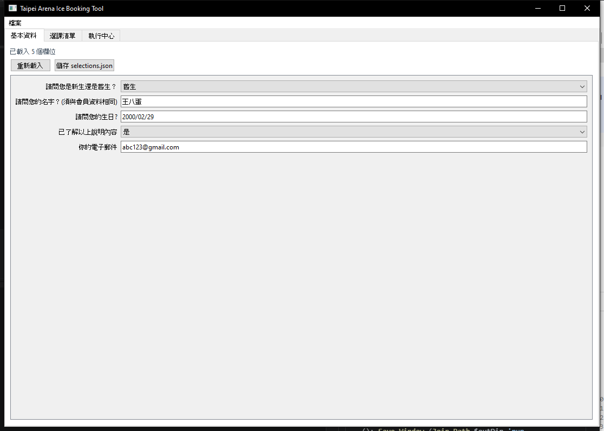
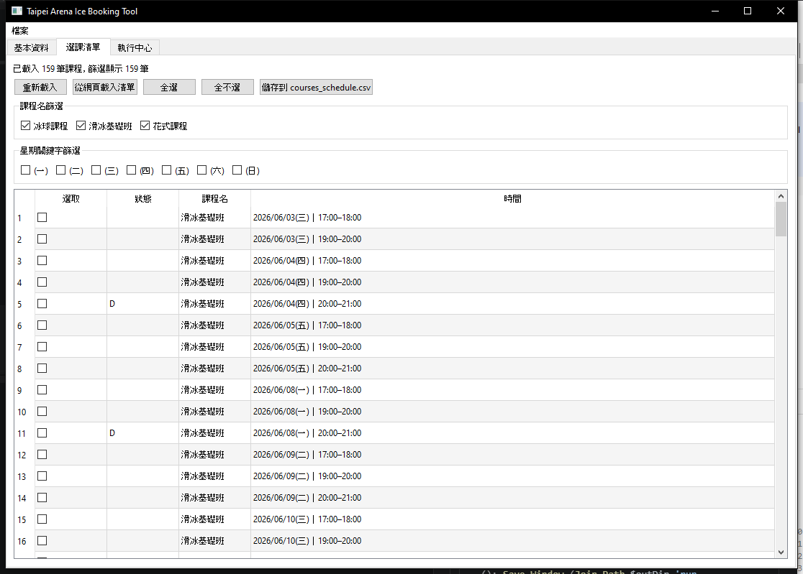
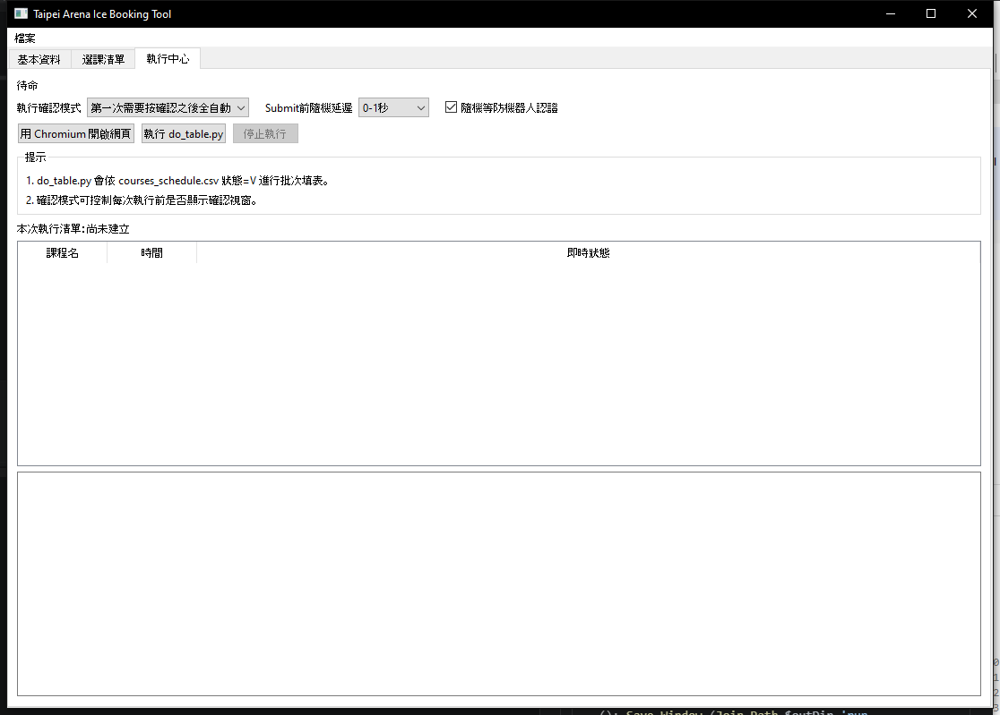

# Google Form 批次填表工具（GUI + 自動化）

此專案用於自動填寫 Google 表單，提供 GUI 操作，不需要手打 CMD。

核心能力：
- 讀取表單題目並同步產生設定檔
- 用 `courses_schedule.csv` 進行批次送出
- `V` 待送出、`D` 已完成（會自動更新）
- 送出前可設定確認模式與延遲策略
- 支援防機器人節奏（每頁隨機等待 + Submit 前隨機等待）
- 執行前自動同步「選課清單」當前勾選狀態到 CSV
- 送出前自動檢查選項是否正確，必要時會自動重填一次

## 主要檔案

- `app.py`
  - PySide6 GUI 主程式
  - 提供「基本資料 / 選課清單 / 執行中心」
- `login.py`
  - 讀取 Google Form 題目
  - 更新 `questions_snapshot.json`、`selections.json`、`courses_schedule.csv`
- `do_table.py`
  - 依 `selections.json` + `courses_schedule.csv` 自動填表
  - 讀取 `狀態=V` 的列，送出成功後改成 `D`
- `selections.json`
  - 基本資料答案（姓名、生日、Email、電話等）
- `courses_schedule.csv`
  - 欄位：`狀態,課程名,時間`

## 狀態規則

- 空白：未排程
- `V`：待送出
- `D`：已完成

## 環境需求

- Windows
- Python 3.11+
- 可登入 Google 帳號

## 安裝

建議直接執行：

```bat
0_install.bat
```

內容等同：

```bat
pip install playwright
pip install pyside6
pip install pyinstaller
playwright install chromium
```

## GUI 使用方式

啟動：

```bat
1_gui.bat
```

### 選課清單頁

- `從網頁載入清單`：會執行 `login.py` 並自動關閉瀏覽器
- 可勾選課程並儲存到 CSV
- 支援篩選：
  - 課程名勾選（可多選）
  - 星期關鍵字勾選 `(一)~(日)`

### 執行中心頁

- `用 Chromium 開啟網頁`
  - 使用本機 `google_profile` 開啟目標表單
  - 可先手動登入 Google，降低流程中斷
- `執行 do_table.py`
  - 執行前會先同步「選課清單」當前勾選結果到 `courses_schedule.csv`
- 可選「確認模式」：
  - 第一次需要按確認之後全自動
  - 每次都需要按確認
  - 全自動執行
- 可選「Submit 前隨機延遲」：
  - 0-1 秒
  - 5-10 秒
  - 30-60 秒
  - 300-600 秒
- 可勾選 `隨機等防機器人認證`（預設勾選）
  - 每次點下一步/提交前增加隨機等待
  - 若 Submit 延遲較長，等待區間會自動拉長
- 顯示本次執行清單與即時狀態
  - 待執行 / 執行中 / 已完成
- Log 即時顯示，不需等待腳本結束

### 人機驗證流程

- 若偵測到人機驗證，會提示判斷依據（URL/關鍵字/可見驗證元件）
- 使用者在瀏覽器完成驗證後，程式會自動輪詢偵測並自動續跑
- 不需要再回終端機按 Enter

### 送出前安全檢查

- 在每頁按「下一步/提交」前會檢查目前選項狀態
- 若不一致會先自動重填，再次檢查
- 同頁出現多組單選（例如初級/進階）時，會優先選擇「包含目標時段」的那一組
- 若按鈕尚未渲染，會先自動等待重試，避免過早誤判為無按鈕

## 介面截圖

請將截圖放到 `docs/images/` 後，即可在 README 顯示。

### 主畫面



### 選課清單



### 執行中心



## 送出前確認內容

在送出按鈕前會跳確認（依模式），內容包含：
- 請問您是新生還是舊生？
- 請問您的名字？(須與會員資料相同)
- 請問您的生日?
- 已了解以上說明內容
- 你的電子郵件
- 本次課程名,時間

## EXE 打包 (未完成)

建立 EXE（onedir）：

```bat
4_build_exe.bat
```

輸出路徑：
- `dist/TaipeiArenaIceBookingTool/`

## EXE 啟動時自動檢查

啟動時會檢查：
- `playwright` 套件是否可用
- Chromium 是否可用

若缺少，會跳出提示並可選擇自動安裝。

## EXE 讀寫檔案位置

已支援 EXE 模式下自動讀寫同資料夾檔案：
- `selections.json`
- `courses_schedule.csv`
- `questions_snapshot.json`
- `google_profile/`

也就是說，把 EXE 與上述檔案放在同一資料夾，就可直接運作。

## 常見問題

- 沒有可執行課程
  - 檢查 `courses_schedule.csv` 是否有 `狀態=V`

- 一直要求登入
  - 確認 `google_profile/` 可寫入且未被清空
  - 可先用「用 Chromium 開啟網頁」手動登入後再執行批次

- 時段對不到
  - `時間` 欄位請直接使用表單原字串

- 顯示「未找到下一步或提交按鈕」
  - 程式會先自動等待重試幾輪，再進入手動暫停
  - 若網路慢或表單載入中，通常重試後會恢復
